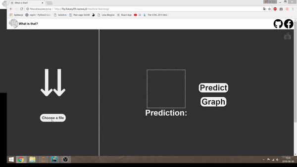
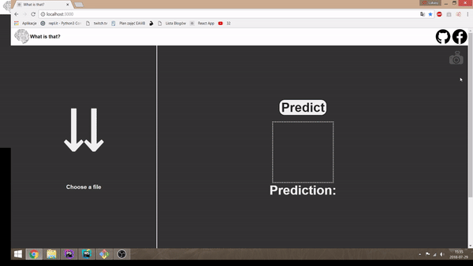

<h1>What is that?</h1>

<p>The project does exactly what the title says. It's trying to guess what is in the picture you pick for it.</p>
<p>You can also plot the results and see what the algorithm thinks it is and its confidence.</p>

<p>The project consists of 2 layers.</p>

<ul>
	<li>Creating a Convolutional Neural Network model(in python using tf&keras libraries).</li>
	<li>Designing a web interface and converting the model to tensorflowjs standards.</li>
</ul>

<p>The application will be continuously upgraded and developed. Some new features will appear in the (near) future.</p>
<p>Below you can see how it works.</p>


<p align="center"> 

</p>

<p>You can take your own photo and predict</p>

<p align="center"> 

</p>

<p>You can install the project on your own computer</p>
```
 # git clone https://github.com/lukasy09/What_Is_That.git
 # npm run install  If you're using WebStorm, the IDE should do it for you.
 # npm start Starting the developer server.
```

<h2>Links</h2>
<p>Resources that I have used to learn about ML and create the projects and other links</p>


<a href="https://www.udemy.com/machinelearning/">Udemy course</a> <br/>
<a href="https://github.com/lukasy09/IchLerneCNN.py">My repository storing the kernel & the model in json</a><br/>
<a href="https://www.youtube.com/watch?v=RznKVRTFkBY&list=PLZbbT5o_s2xrwRnXk_yCPtnqqo4_u2YGL">Keras tutorial playlist</a><br/>
<a href="https://js.tensorflow.org/tutorials/">TensorFlowjs docs</a><br/>
<a href="https://github.com/SkalskiP/ILearnMachineLearning.js">Piotr Skalski's repository with similar projects</a><br/>
<a href="https://medium.com/@piotr.skalski92/my-first-tensorflow-js-project-b481bdad17fb">Piotr Skalski's article on ML and steps in creating such projects</a>