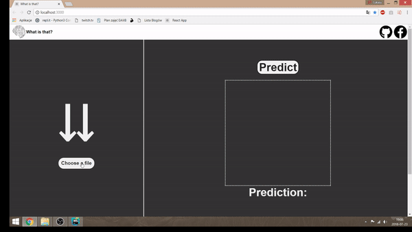

##Title
<h1>What is that?</h1>
#Begin

The project does exactly what the title says. It's trying to guess what is in the picture you pick for it.

##Description

The project consists of 2 layers.

<ul>
	<li>Creating a Convolutional Neural Network model(in python using tf&keras libraries).</li>
	<li>Designing a web interface and converting the model to tensorflowjs standards.</li>
</ul>

The application will be continuously upgraded and developed. Some new features will appear in the (near) future.

Below you can see how it works.

##Video

 

<h2>Links</h2>

Resources that I have used to learn about ML and create the projects and other links

[Udemy crash course][1]
[IchLerneCNN.py - my repository storing the code of creating "the backend model"][2]
[Keras tutorial playlist][3]
[TensorFlowjs docs][4]
[Piotr Skalski's repository with similar projects][5]
[Piotr Skalski's article on ML and steps in creating such projects][6]

[1]: https://www.udemy.com/machinelearning/
[2]: https://www.youtube.com/watch?v=RznKVRTFkBY&list=PLZbbT5o_s2xrwRnXk_yCPtnqqo4_u2YGL
[3]: https://github.com/lukasy09/IchLerneCNN.py
[4]: https://js.tensorflow.org/tutorials/
[5]: https://github.com/SkalskiP/ILearnMachineLearning.js
[6]:https://medium.com/@piotr.skalski92/my-first-tensorflow-js-project-b481bdad17fb