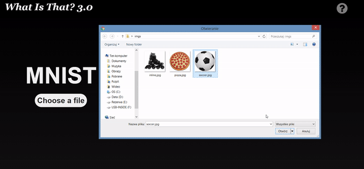
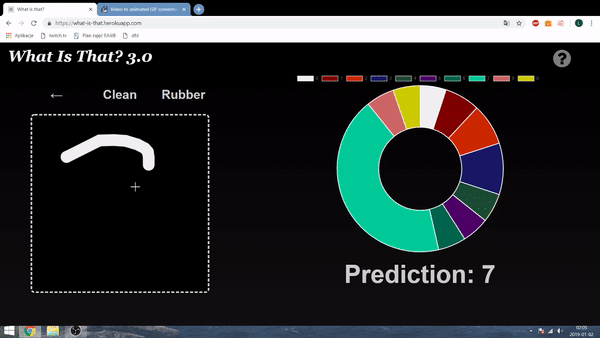

<h1>What is that?</h1>

The purpose of the project was to combine 2 programming skills: Machine Learning and building frontend apps.

The project is compound of 2 meaningful parts.

1. Real-life object recognition model

2. Hand-written digit recognition model

<h1>2. Sample working of the application</h1>

 

	

<h1>3.Links </h1>

Resources that I was using learn about ML and create the projects and other links

<a href="https://github.com/lukasy09/KernelBase.py">Repository with hosted model</a> 
<a href="https://www.kaggle.com/c/digit-recognizer">MNIST Database</a> 
<a href="https://www.youtube.com/watch?v=RznKVRTFkBY&list=PLZbbT5o_s2xrwRnXk_yCPtnqqo4_u2YGL">Keras tutorial playlist</a> 
<a href="https://js.tensorflow.org/tutorials/">TensorFlowjs docs</a> 
